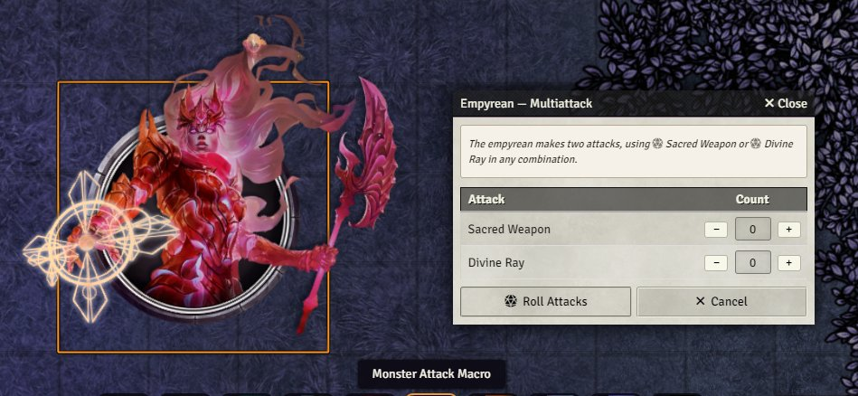
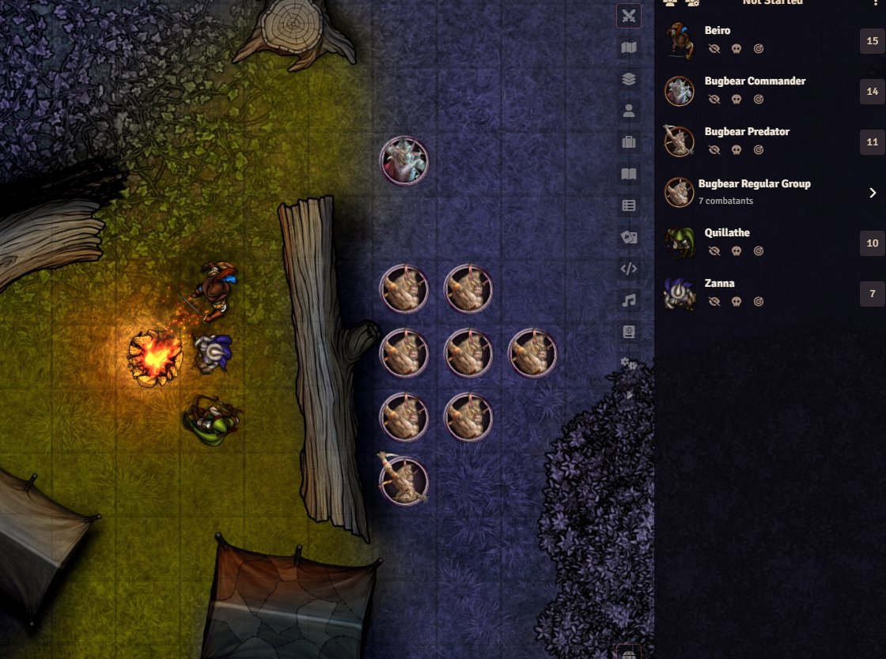
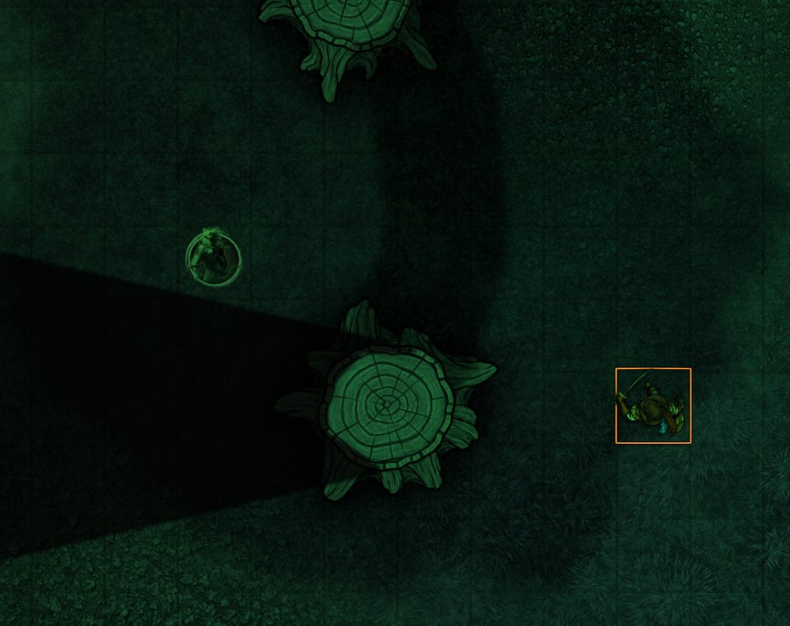
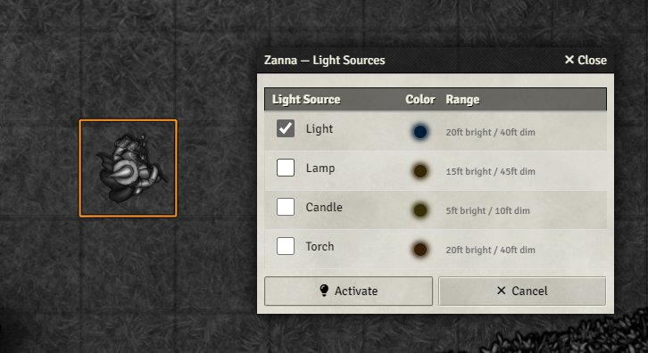
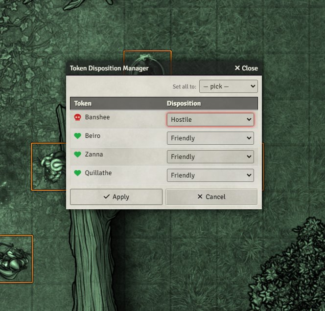

#  Bart's Macros

A collection of FoundryVTT macros built to make running games and game prep faster and less click-intensive. For example, I don't like clicking into monsters' sheets to find attacks over and over, and even setting the attacks in the hotbar has pain points for me. These macros are designed inside the Foundry D&D5e system, though several macros might work in other systems. I am happy to attempt cross-compatibility where people request it, but I don't promise anything, as I am very new to coding. 

---

##  Installation

You can grab the macros as a compendium if you like. The manifest is here:

```
https://github.com/bklick/bartsmacros/releases/latest/download/module.json
```
## Macros

- [Multiattack](#multiattack)
- [Same Initiative Grouper](#same-initiative-grouper)
- [Group Skipper](#group-skipper)
- [Darkvision 60ft](#darkvision-60ft)
- [Darkvision 120ft](#darkvision-120ft)
- [Light Sources](#light-sources)
- [Disposition Changer](#disposition-changer)
- [Condition Cleaner](#condition-cleaner)

---

## Multiattack Macro

When you select a token and run this macro, it reads the actor's Multiattack description and lists all of that token's attack items. You choose how many times to use each attack, then click **Roll Attacks** to fire them all off in sequence.

If no Multiattack feature is found, it still works, it just shows all available attacks and lets you pick which ones to use. This makes it useful for rolling multiple attacks from weaker enemies like kobolds all at once, especially in combination with the Group macros below.

You can also hand this macro to your players, though they will see more items than expected (any item with an attack roll will appear, so, for example, torches).



<details>
<summary> Copy Macro Code</summary>

```javascript
/**
 * Multiattack dialog — reads the actor's Multiattack description
 * and lets the DM choose how many times to use each attack item.
 */
const token = canvas.tokens.controlled[0];
const actor = token?.actor;

if (!actor) {
  ui.notifications.warn("Select a token first.");
  return;
}

const multiattack = actor.items.find(i => i.name.toLowerCase() === "multiattack");

const attackItems = actor.items.filter(i =>
  i.hasAttack && i.name.toLowerCase() !== "multiattack"
);

if (!attackItems.length) {
  ui.notifications.warn(`No attack items found on ${actor.name}.`);
  return;
}

// Show multiattack description if found, so DM has the text as reference
const enriched = multiattack
  ? await TextEditor.enrichHTML(multiattack.system.description.value, { relativeTo: actor })
  : null;

const descBlock = enriched
  ? `<div style="
      margin-bottom: 10px;
      padding: 6px 8px;
      background: #f5f0e8;
      border: 1px solid #b5a990;
      border-radius: 3px;
      font-size: 0.85em;
      font-style: italic;
      line-height: 1.4;
    ">${enriched}</div>`
  : `<p style="font-style:italic; color:#888; margin-bottom:8px;">
      No Multiattack feature found — select attacks manually.
    </p>`;

const rows = attackItems.map((item, i) => `
  <tr style="border-bottom: 1px solid #ddd;">
    <td style="padding: 5px 8px;">${item.name}</td>
    <td style="text-align: center; padding: 5px; white-space: nowrap;">
      <button type="button" style="width: 26px; line-height: 1;" onclick="
        const el = document.getElementById('atk-count-${i}');
        el.value = Math.max(0, parseInt(el.value) - 1);
      ">−</button>
      <input
        id="atk-count-${i}"
        type="number" value="0" min="0" max="20"
        style="width: 40px; text-align: center; margin: 0 3px;"
      />
      <button type="button" style="width: 26px; line-height: 1;" onclick="
        const el = document.getElementById('atk-count-${i}');
        el.value = parseInt(el.value) + 1;
      ">+</button>
    </td>
  </tr>
`).join("");

const content = `
  ${descBlock}
  <table style="width: 100%; border-collapse: collapse;">
    <thead>
      <tr style="border-bottom: 2px solid #aaa;">
        <th style="text-align: left; padding: 4px 8px;">Attack</th>
        <th style="text-align: center; padding: 4px; width: 120px;">Count</th>
      </tr>
    </thead>
    <tbody>${rows}</tbody>
  </table>
`;

new Dialog({
  title: `${actor.name} — Multiattack`,
  content,
  buttons: {
    roll: {
      icon: `<i class="fas fa-dice-d20"></i>`,
      label: "Roll Attacks",
      callback: async (html) => {
        for (let i = 0; i < attackItems.length; i++) {
          const count = parseInt(html.find(`#atk-count-${i}`).val()) || 0;
          for (let j = 0; j < count; j++) {
            await attackItems[i].use()
          }
        }
      }
    },
    cancel: {
      icon: `<i class="fas fa-times"></i>`,
      label: "Cancel"
    }
  },
  default: "roll",
  render: (html) => {
    html.find("input").on("keydown", e => { if (e.key === "Enter") e.preventDefault(); });
  }
}).render(true);
```

</details>

---

## Same Initiative Grouper

I run a lot of encounters with hordes and minions. This macro scans the current combat encounter, finds creatures that share a name, and sets all of them to the **median initiative** of that group — collapsing them into a single entry in the combat tracker.

Run this after rolling initiative for your monsters before combat begins. Works best alongside the [Group Skipper](#group-skipper) macro.



<details>
<summary> Copy Macro Code</summary>

```javascript
/**
 * Group Initiative — scans the current encounter for monsters sharing
 * a name and sets them all to the median initiative of that group.
 */

if (!game.combat) {
  ui.notifications.warn("No active encounter found.");
  return;
}

const combatants = game.combat.combatants.contents;

// Group combatants by name
const groups = {};
for (const c of combatants) {
  const key = c.name.toLowerCase().trim();
  if (!groups[key]) groups[key] = [];
  groups[key].push(c);
}

// Only care about groups with duplicates
const duplicateGroups = Object.values(groups).filter(g => g.length > 1);

if (!duplicateGroups.length) {
  ui.notifications.info("No duplicate names found in the current encounter.");
  return;
}

function median(arr) {
  const sorted = [...arr].sort((a, b) => a - b);
  const mid = Math.floor(sorted.length / 2);
  return sorted.length % 2 !== 0
    ? sorted[mid]
    : Math.round((sorted[mid - 1] + sorted[mid]) / 2);
}

const updates = [];
const summary = [];
const skipped = [];

for (const group of duplicateGroups) {
  const rolled = group.filter(c => c.initiative !== null);

  if (!rolled.length) {
    skipped.push(group[0].name);
    continue;
  }

  const med = median(rolled.map(c => c.initiative));
  summary.push(`${group[0].name} ×${group.length} → ${med}`);

  for (const c of group) {
    updates.push({ _id: c.id, initiative: med });
  }
}

if (!updates.length) {
  ui.notifications.warn(
    `Duplicate groups found but none have rolled initiative yet: ${skipped.join(", ")}.`
  );
  return;
}

await game.combat.updateEmbeddedDocuments("Combatant", updates);

const parts = [];
if (summary.length) parts.push(`Grouped: ${summary.join(", ")}`);
if (skipped.length) parts.push(`Skipped (no rolls): ${skipped.join(", ")}`);
ui.notifications.info(parts.join(" | "));
```

</details>

---

## Group Skipper

The companion macro to the [Same Initiative Grouper](#same-initiative-grouper). During combat, during a grouped creature's turn, run this macro to **jump past all remaining members of that group** and land on the next different combatant.

**Recommended workflow:**
1. Roll initiative for your monsters
2. Run **Same Initiative Grouper**
3. Begin combat normally
4. When a group's turn comes up: move all their tokens, roll all their attacks with the [Multiattack](#multiattack) macro, then click **Group Skipper** to move on.

<details>
<summary>Copy Macro Code</summary>

```javascript
/**
 * Group Skip — advances past all remaining combatants in the current
 * group, landing on the next combatant with a different name.
 */

if (!game.combat) {
  ui.notifications.warn("No active encounter found.");
  return;
}

const current = game.combat.combatant;

if (!current) {
  ui.notifications.warn("No active combatant.");
  return;
}

const currentName = current.name.toLowerCase().trim();

// Get the turn order as a sorted array
const sorted = game.combat.turns;
const currentIndex = sorted.findIndex(c => c.id === current.id);

// Find the next combatant with a different name
const nextIndex = sorted.findIndex((c, i) =>
  i > currentIndex && c.name.toLowerCase().trim() !== currentName
);

if (nextIndex === -1) {
  ui.notifications.warn("No non-grouped combatant found after this group.");
  return;
}

await game.combat.update({ turn: nextIndex });
ui.notifications.info(
  `Skipped ${current.name}'s group — now up: ${sorted[nextIndex].name}.`
);
```

</details>

---

## Darkvision 60ft

Select a token and run this macro to apply darkvision (60ft range) to both the placed token on the canvas and its prototype token. The vision renders in the classic green-tinted darkvision style.

If 60ft doesn't match the creature you're setting up, you can edit the macro — just find `range: 60` and change it to whatever you need.



<details>
<summary>Copy Macro Code</summary>

```javascript
/**
 * Apply prototype token vision settings to the controlled actor
 * and update their placed token on the canvas.
 */
const token = canvas.tokens.controlled[0];
const actor = token?.actor ?? game.user.character;

if (!actor) {
  ui.notifications.warn("No controlled token or assigned character found.");
} else {
  const sightData = {
    sight: {
      enabled: true,
      range: 60,
      angle: 360,
      visionMode: "darkvision",
      color: "#3d7445",
      attenuation: 1,
      brightness: 1,
      saturation: 1,
    },
    detectionModes: [
      { id: "basicSight", range: 60, enabled: true },
    ],
  };

  // Update prototype token
  await actor.prototypeToken.update(sightData);

  // Update placed token if one is controlled
  if (token) {
    await token.document.update(sightData);
  }

  ui.notifications.info(`Vision settings updated for ${actor.name}.`);
}
```

</details>

---

## Darkvision 120ft

Identical to the 60ft version, but sets the range to 120ft. My players love to be drow, so I have this one saved now.

<details>
<summary>Copy Macro Code</summary>

```javascript
/**
 * Apply prototype token vision settings to the controlled actor
 * and update their placed token on the canvas.
 */
const token = canvas.tokens.controlled[0];
const actor = token?.actor ?? game.user.character;

if (!actor) {
  ui.notifications.warn("No controlled token or assigned character found.");
} else {
  const sightData = {
    sight: {
      enabled: true,
      range: 120,
      angle: 360,
      visionMode: "darkvision",
      color: "#3d7445",
      attenuation: 1,
      brightness: 1,
      saturation: 1,
    },
    detectionModes: [
      { id: "basicSight", range: 120, enabled: true },
    ],
  };

  // Update prototype token
  await actor.prototypeToken.update(sightData);

  // Update placed token if one is controlled
  if (token) {
    await token.document.update(sightData);
  }

  ui.notifications.info(`Vision settings updated for ${actor.name}.`);
}
```

</details>

---

## Light Sources

This macro scans the selected token's inventory for recognizable light source items (torches, lanterns, candles, spells, magic items, etc.) and presents a dialog to choose which to activate. Each source shows its color (which you can click to customize) and its bright/dim radius.

Click **Activate** to apply the light to the token. Run the macro again while the token is already lit to extinguish the light.

Most light-producing items in D&D 5e don't behave how I expect out of the box in Foundry. This macro prevents me from having to spend a lot of time fiddling around in someone's token settings. If you find a common light source I've missed, feel free to open an issue and I'll add it.



<details>
<summary> Copy Macro Code</summary>

```javascript
/**
 * Light Source dialog — finds light items on the token's actor,
 * lets the user select which to use, applies the appropriate
 * light effect to the token. Run again to extinguish.
 */

function hslToHex(h, s255, l255) {
  const s = s255 / 255, l = l255 / 255;
  const C = (1 - Math.abs(2 * l - 1)) * s;
  const X = C * (1 - Math.abs((h / 60) % 2 - 1));
  const m = l - C / 2;
  let r, g, b;
  if      (h < 60)  { r = C; g = X; b = 0; }
  else if (h < 120) { r = X; g = C; b = 0; }
  else if (h < 180) { r = 0; g = C; b = X; }
  else if (h < 240) { r = 0; g = X; b = C; }
  else if (h < 300) { r = X; g = 0; b = C; }
  else              { r = C; g = 0; b = X; }
  const hex = v => Math.round((v + m) * 255).toString(16).padStart(2, "0");
  return `#${hex(r)}${hex(g)}${hex(b)}`;
}

const LIGHT_CONFIGS = {
  "torch":             { hue: 30,  bright: 20, dim: 40,  anim: "torch",    speed: 5, intensity: 5 },
  "candle":            { hue: 48,  bright: 5,  dim: 10,  anim: "torch",    speed: 2, intensity: 2 },
  "lamp":              { hue: 38,  bright: 15, dim: 45,  anim: "torch",    speed: 3, intensity: 3 },
  "lantern, hooded":   { hue: 35,  bright: 30, dim: 60,  anim: "torch",    speed: 4, intensity: 4 },
  "hooded lantern":    { hue: 35,  bright: 30, dim: 60,  anim: "torch",    speed: 4, intensity: 4 },
  "bullseye lantern":  { hue: 52,  bright: 60, dim: 120, anim: "torch",    speed: 3, intensity: 3 },
  "everburning torch": { hue: 30,  bright: 20, dim: 40,  anim: "torch",    speed: 3, intensity: 3 },
  "light":             { hue: 210, bright: 20, dim: 40,  anim: "pulse",    speed: 3, intensity: 3 },
  "dancing lights":    { hue: 220, bright: 0,  dim: 10,  anim: "torch",    speed: 5, intensity: 2 },
  "continual flame":   { hue: 185, bright: 20, dim: 40,  anim: "pulse",    speed: 2, intensity: 2 },
  "faerie fire":       { hue: 275, bright: 0,  dim: 10,  anim: "pulse",    speed: 4, intensity: 4 },
  "daylight":          { hue: 58,  bright: 60, dim: 120, anim: "",         speed: 0, intensity: 0 },
  "dawn":              { hue: 52,  bright: 30, dim: 60,  anim: "sunburst", speed: 3, intensity: 3 },
  "sunbeam":           { hue: 55,  bright: 60, dim: 120, anim: "sunburst", speed: 5, intensity: 5 },
  "sunburst":          { hue: 55,  bright: 60, dim: 120, anim: "sunburst", speed: 5, intensity: 5 },
  "flame tongue":      { hue: 15,  bright: 20, dim: 40,  anim: "torch",    speed: 7, intensity: 7 },
  "sunblade":          { hue: 55,  bright: 15, dim: 30,  anim: "pulse",    speed: 4, intensity: 4 },
};

const SAT = 240;
const LUM = 30;

const token =
  canvas.tokens.controlled[0] ??
  game.user.character?.getActiveTokens()[0];

if (!token) {
  ui.notifications.warn("No token found. Select a token or assign a character.");
  return;
}

const actor = token.actor;

// --- TOGGLE OFF if lights are already active ---
const lit = token.document.light;
if (lit.bright > 0 || lit.dim > 0) {
  await token.document.update({
    light: {
      bright: 0,
      dim: 0,
      color: null,
      alpha: 0.5,
      animation: { type: "", speed: 0, intensity: 0 },
    },
  });
  ui.notifications.info(`Lights extinguished on ${actor.name}.`);
  return;
}

// --- FIND matching light items on the actor ---
const lightItems = actor.items.filter(i =>
  i.name.toLowerCase().trim() in LIGHT_CONFIGS
);

if (!lightItems.length) {
  ui.notifications.warn(`No light source items found on ${actor.name}.`);
  return;
}

// --- BUILD DIALOG ---
const rows = lightItems.map((item, i) => {
  const cfg = LIGHT_CONFIGS[item.name.toLowerCase().trim()];
  const color = hslToHex(cfg.hue, SAT, LUM);
  const rangeLabel = cfg.bright > 0
    ? `${cfg.bright}ft bright / ${cfg.dim}ft dim`
    : `${cfg.dim}ft dim only`;
  return `
    <tr style="border-bottom: 1px solid #ddd;">
      <td style="padding: 5px 8px;">
        <label style="display:flex; align-items:center; gap:8px; cursor:pointer;">
          <input type="checkbox" id="light-check-${i}" style="cursor:pointer;" />
          ${item.name}
        </label>
      </td>
      <td style="text-align:center; padding:5px;">
        <input
          type="color"
          id="light-color-${i}"
          value="${color}"
          style="opacity:0; position:absolute; width:0; height:0; pointer-events:none;"
        />
        <span
          id="light-swatch-${i}"
          onclick="document.getElementById('light-color-${i}').click()"
          style="
            display:inline-block; width:16px; height:16px;
            background:${color};
            border-radius:50%;
            border:1px solid #666;
            box-shadow: 0 0 6px 2px ${color};
            vertical-align:middle;
            cursor:pointer;
          "
        ></span>
      </td>
      <td style="padding:5px 8px; font-size:0.8em; color:#666;">
        ${rangeLabel}
      </td>
    </tr>
  `;
}).join("");

const content = `
  <table style="width:100%; border-collapse:collapse;">
    <thead>
      <tr style="border-bottom:2px solid #aaa;">
        <th style="text-align:left; padding:4px 8px;">Light Source</th>
        <th style="padding:4px; width:36px;">Color</th>
        <th style="text-align:left; padding:4px 8px;">Range</th>
      </tr>
    </thead>
    <tbody>${rows}</tbody>
  </table>
`;

new Dialog({
  title: `${actor.name} — Light Sources`,
  content,
  buttons: {
    activate: {
      icon: `<i class="fas fa-lightbulb"></i>`,
      label: "Activate",
      callback: async (html) => {
        const selected = lightItems.filter((_, i) =>
          html.find(`#light-check-${i}`).prop("checked")
        );

        if (!selected.length) {
          ui.notifications.warn("Select at least one light source.");
          return;
        }

        const configs = selected.map(item =>
          LIGHT_CONFIGS[item.name.toLowerCase().trim()]
        );

        const dominant = configs.reduce((a, b) => b.bright >= a.bright ? b : a);
        const dominantIndex = lightItems.indexOf(
          selected.reduce((a, b) =>
            LIGHT_CONFIGS[b.name.toLowerCase().trim()].bright >=
            LIGHT_CONFIGS[a.name.toLowerCase().trim()].bright ? b : a
          )
        );
        const maxBright = Math.max(...configs.map(c => c.bright));
        const maxDim    = Math.max(...configs.map(c => c.dim));

        const color = html.find(`#light-color-${dominantIndex}`).val();

        for (const item of selected) {
          await item.use({ configureDialog: false });
        }

        await token.document.update({
          light: {
            bright: maxBright,
            dim:    maxDim,
            color,
            alpha: 0.5,
            animation: {
              type:      dominant.anim,
              speed:     dominant.speed,
              intensity: dominant.intensity,
            },
          },
        });

        ui.notifications.info(`${actor.name} lights up.`);
      },
    },
    cancel: {
      icon: `<i class="fas fa-times"></i>`,
      label: "Cancel",
    },
  },
  default: "activate",
  render: (html) => {
    html.find("input").on("keydown", e => {
      if (e.key === "Enter") e.preventDefault();
    });

    lightItems.forEach((_, i) => {
      html.find(`#light-color-${i}`).on("input", function () {
        const val = this.value;
        const swatch = html.find(`#light-swatch-${i}`);
        swatch.css({
          background: val,
          "box-shadow": `0 0 6px 2px ${val}`,
        });
      });
    });
  },
}).render(true);
```

</details>

---

## Disposition Changer

Foundry's default token disposition is Hostile (red border), which occasionally causes confusion — especially when a friendly NPC has a red ring and my players get suspicious for no reason. Some modules (like Monk's TokenBar) also use disposition, so I made this macro to quickly change that variable. (Also, this is how I learned about the "secret" disposition, which is just plain fun, especially if you have players paying attention to the border colors and making assumptions based on them. :-))

Select one or more tokens, run this macro, and you can set each token's disposition individually. You can also use the **set all to** dropdown to change them all at once.



<details>
<summary>Copy Macro Code</summary>

```javascript
/**
 * Disposition Manager — shows all selected tokens with their current
 * disposition and lets the DM change them individually or all at once.
 */

const tokens = canvas.tokens.controlled;

if (!tokens.length) {
  ui.notifications.warn("Select at least one token first.");
  return;
}

const DISPOSITIONS = {
  "-2": { label: "Secret",   color: "#888888", icon: "fa-eye-slash" },
  "-1": { label: "Hostile",  color: "#cc2222", icon: "fa-skull" },
   "0": { label: "Neutral",  color: "#ccaa00", icon: "fa-minus" },
   "1": { label: "Friendly", color: "#22aa44", icon: "fa-heart" },
};

const options = Object.entries(DISPOSITIONS).map(([val, d]) =>
  `<option value="${val}">${d.label}</option>`
).join("");

const rows = tokens.map((tok, i) => {
  const disp = String(tok.document.disposition);
  const d = DISPOSITIONS[disp] ?? DISPOSITIONS["0"];
  return `
    <tr style="border-bottom: 1px solid #ddd;">
      <td style="padding: 5px 8px; display:flex; align-items:center; gap:8px;">
        <i
          id="disp-icon-${i}"
          class="fas ${d.icon}"
          style="color:${d.color}; width:14px; text-align:center;"
        ></i>
        ${tok.name}
      </td>
      <td style="padding: 5px 8px;">
        <select
          id="disp-select-${i}"
          style="width:100%;"
        >
          ${Object.entries(DISPOSITIONS).map(([val, dd]) =>
            `<option value="${val}" ${val === disp ? "selected" : ""}>${dd.label}</option>`
          ).join("")}
        </select>
      </td>
    </tr>
  `;
}).join("");

const content = `
  <div style="margin-bottom:8px; display:flex; justify-content:flex-end; gap:6px; align-items:center;">
    <label style="font-size:0.85em; color:#666;">Set all to:</label>
    <select id="disp-all" style="width:120px;">
      <option value="" disabled selected>— pick —</option>
      ${options}
    </select>
  </div>
  <table style="width:100%; border-collapse:collapse;">
    <thead>
      <tr style="border-bottom:2px solid #aaa;">
        <th style="text-align:left; padding:4px 8px;">Token</th>
        <th style="text-align:left; padding:4px 8px;">Disposition</th>
      </tr>
    </thead>
    <tbody>${rows}</tbody>
  </table>
`;

new Dialog({
  title: "Token Disposition Manager",
  content,
  buttons: {
    apply: {
      icon: `<i class="fas fa-check"></i>`,
      label: "Apply",
      callback: async (html) => {
        const updates = tokens.map((tok, i) => ({
          token: tok,
          disposition: parseInt(html.find(`#disp-select-${i}`).val()),
        }));

        for (const { token, disposition } of updates) {
          await token.document.update({ disposition });
        }

        ui.notifications.info(`Updated disposition for ${tokens.length} token(s).`);
      },
    },
    cancel: {
      icon: `<i class="fas fa-times"></i>`,
      label: "Cancel",
    },
  },
  default: "apply",
  render: (html) => {
    html.find("#disp-all").on("change", function () {
      const val = this.value;
      tokens.forEach((_, i) => {
        html.find(`#disp-select-${i}`).val(val);
        updateIcon(html, i, val);
      });
    });

    tokens.forEach((_, i) => {
      html.find(`#disp-select-${i}`).on("change", function () {
        updateIcon(html, i, this.value);
      });
    });

    function updateIcon(html, i, val) {
      const d = DISPOSITIONS[val] ?? DISPOSITIONS["0"];
      const icon = html.find(`#disp-icon-${i}`);
      icon.attr("class", `fas ${d.icon}`);
      icon.css("color", d.color);
    }
  },
}).render(true);
```

</details>

---

## Condition Cleaner

Between sessions, my players tend to accumulate leftover conditions. This macro finds every player-owned token on the current scene and wipes their active conditions.

<details>
<summary>Copy Macro Code</summary>

```javascript
/**
 * Clear all conditions from tokens owned by players.
 */
const promises = [];

const playerTokens = canvas.tokens.placeables.filter(tok =>
  tok.actor?.hasPlayerOwner
);

if (!playerTokens.length) {
  ui.notifications.warn("No player-owned tokens found on this scene.");
} else {
  for (const tok of playerTokens) {
    if (!tok.actor) continue;

    // Status Icon Counters module support
    if (typeof EffectCounter !== "undefined") {
      promises.push(EffectCounter.clearEffects(tok.document));
    }

    if (game.system.id === "pf2e") {
      const ids = [
        ...tok.actor.itemTypes.condition.map(x => x.id),
        ...tok.actor.itemTypes.effect.map(x => x.id),
      ];
      if (ids.length > 0)
        promises.push(tok.actor.deleteEmbeddedDocuments("Item", ids));
    } else {
      const ids = tok.actor.effects
        .filter(e => e.statuses?.size > 0)
        .map(e => e.id);
      if (ids.length > 0)
        promises.push(tok.actor.deleteEmbeddedDocuments("ActiveEffect", ids));
    }
  }

  await Promise.all(promises);
  ui.notifications.info(`Cleared conditions from ${playerTokens.length} token(s).`);
}
```

</details>

---

## Contributing

Feel free to open an issue if you have a problem. I'll do my best to fix it. You are also welcome to fork this for your own purposes.

Thanks for reading! If you like this, check out the stuff I make (very occasionally) on [patreon](https://www.patreon.com/c/barts_rpg_stuff). 
---

## License & AI Disclaimer

This project is licensed under [CC BY-NC 4.0](https://creativecommons.org/licenses/by-nc/4.0/).
You are free to use, modify, and share these macros for non-commercial purposes with attribution.

I used Claude AI to help me when I couldn't figure out something, especially bugs. I am an incredibly hesistant user of LLMs, but it has been invaluable in helping me learn and identify bugs. Because these do contain a lot of LLM help, I assert no authorial control over them; please feel free to use them as you see fit. 

The licence is CC-BY-NC 4.0, but if you have a commercial project and would like these macros to be included in it for whatever reason, just ask. I don't want to prevent you from doing something cool.
